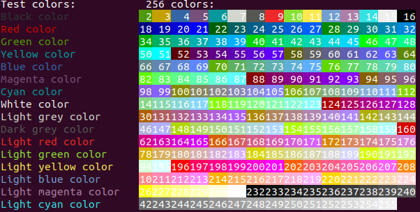

## Example

```python
import sys
from termcolor import colored, cprint, COLOR_RED, ATTR_BOLD

text = colored('Hello, World!', termcolor.COLOR_RED)
print(text)
cprint('Hello, World!', 'green', 'on_red', attrs=['reverse', 'blink'])

print_red_on_cyan = lambda x: cprint(x, 'red', 'on_cyan')
print_red_on_cyan('Hello, World!')
print_red_on_cyan('Hello, Universe!')

for i in range(10):
    cprint(str(i), 'magenta', end=' ')

cprint("Attention!", 'red', attrs=termcolor.ATTR_BOLD, file=sys.stderr)
```

## Text properties

| Text colors   | Text highlights  | Attributes |
| ------------- | ---------------- | ---------- |
| black         | on_black         | bold       |
| grey          | on_grey          | dark       | 
| red           | on_red           | underline  |
| green         | on_green         | blink      | 
| yellow        | on_yellow        | reverse    | 
| blue          | on_blue          | concealed  | 
| magneta       | on_magneta       |            | 
| cyan          | on_cyan          |            | 
| light_grey    | on_light_grey    |            | 
| dark_grey     | on_dark_grey     |            |
| light_red     | on_light_red     |            |
| light_green   | on_light_green   |            |
| light_yellow  | on_light_yellow  |            | 
| light_blue    | on_light_blue    |            | 
| light_magenta | on_light_magenta |            | 
| light_cyan    | on_light_cyan    |            | 
| white         | on_white         |            |

## Terminal properties

| Terminal         | bold    | dark | underline | blink      | reverse | concealed |
| ---------------- | ------- | ---- | --------- | ---------- | ------- | --------- |
| **xterm**        | yes     | no   | yes       | bold       | yes     | yes       |
| **linux**        | yes     | yes  | bold      | yes        | yes     | no        |
| **rxvt**         | yes     | no   | yes       | bold/black | yes     | no        |
| **dtterm**       | yes     | yes  | yes       | reverse    | yes     | yes       |
| **teraterm**     | reverse | no   | yes       | rev/red    | yes     | no        |
| **aixterm**      | normal  | no   | yes       | no         | yes     | yes       |
| **PuTTY**        | color   | no   | yes       | no         | yes     | no        |
| **Windows**      | no      | no   | no        | no         | yes     | no        |
| **Cygwin SSH**   | yes     | no   | color     | color      | color   | yes       |
| **Mac Terminal** | yes     | no   | yes       | yes        | yes     | yes       |

## Changes

#### 1.3.2 (23.10.2021)

- Minor bugfix.
- Added const file enum.py.

#### 1.3.0 (23.10.2021)

- Converted to package.

#### 1.1.0 (13.01.2011)

- Added cprint function.

#### 1.0.1 (13.01.2011)

- Updated README.rst.

#### 1.0.0 (13.01.2011)

- Changed license to MIT.
- Updated copyright.
- Refactored source code.

#### 0.2 (07.09.2010)

- Added support of Python 3.x.

#### 0.1.2 (04.06.2009)

- Fixed bold characters. (Thanks Tibor Fekete)

#### 0.1.1 (05.03.2009)

- Some refactoring.
- Updated copyright.
- Fixed reset colors.
- Updated documentation.

#### 0.1 (09.06.2008)

- Initial release.
        
